<h1 align="center">Hi 👋, I'm Timo Sand</h1>
<h3 align="center">A polyglot engineer with a long background in varied projects.</h3>

- 🔭 I’m currently working as [a Lead Platform Engineer driving Developer Experience](https://www.f-secure.com/fi)

- 👨‍💻 All of my projects are available at [github.com/deiga](https://github.com/deiga)

- 💬 Ask me about **Hiring developers, leading a team, team culture, mentoring, IaC, Kubernetes, Terraform, Developer Experience and other automation**

- 📄 Know about my experiences [https://www.linkedin.com/in/timosand/](https://www.linkedin.com/in/timosand/)

<h3 align="left">Connect with me:</h3>

<a href="https://github.com/anuraghazra/github-readme-stats">
  
  &nbsp;
  
</a>
